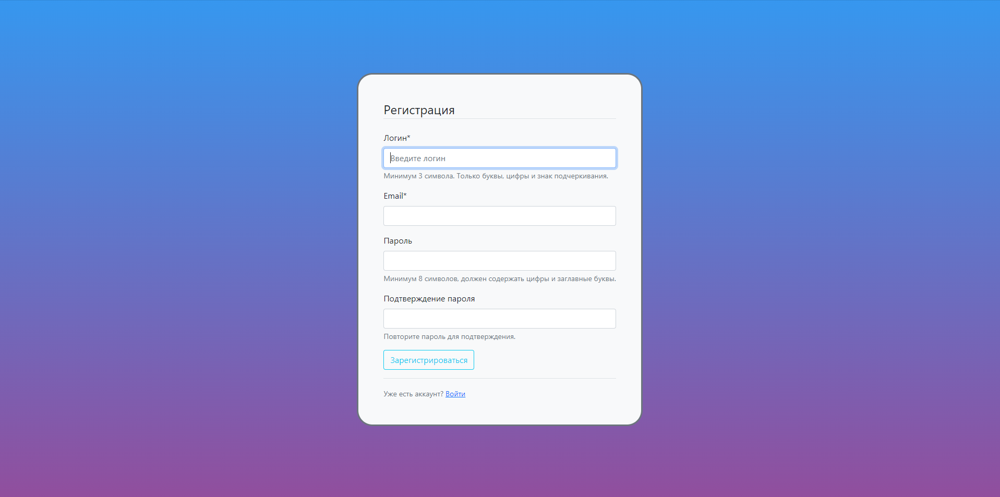
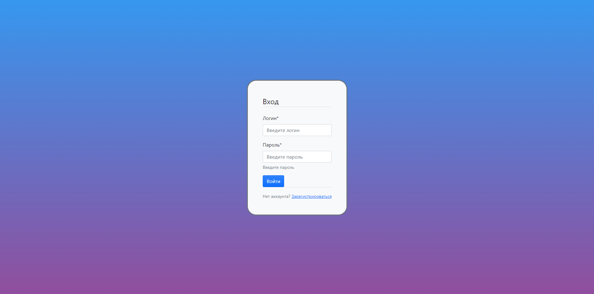
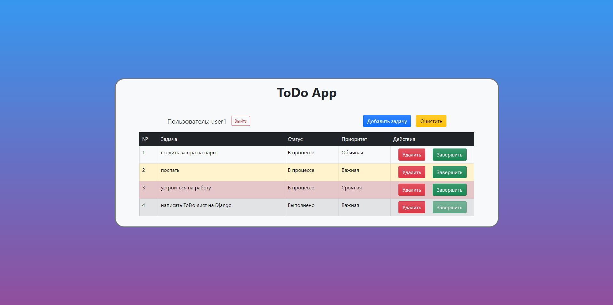
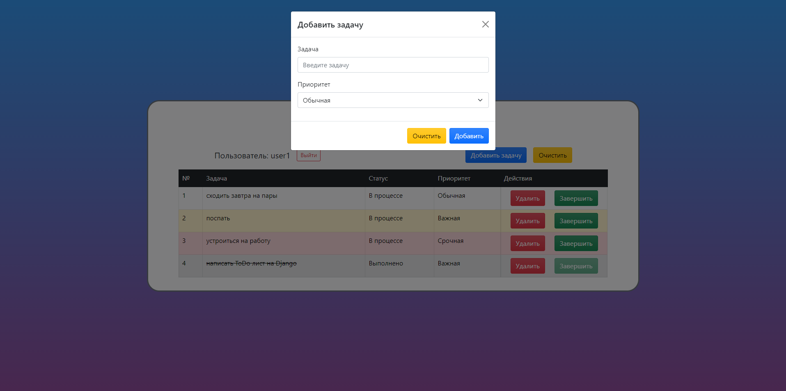
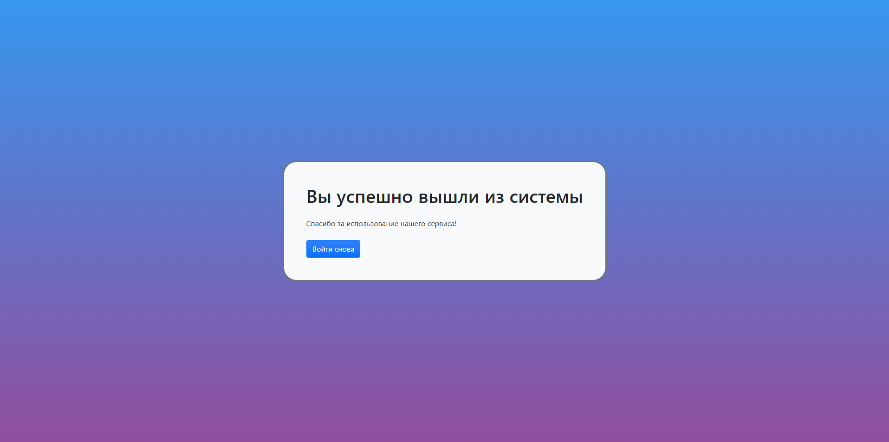

# Django ToDo List

Веб-приложение для управления списком задач с системой авторизации, написанное на Django.

## Описание

Это многопользовательское приложение для управления задачами, которое позволяет создавать и отслеживать выполнение задач. Каждый пользователь имеет доступ только к своим задачам после авторизации.

### Основные функции

- Регистрация и авторизация пользователей с валидацией полей
- Создание новых задач
- Установка приоритета задач (Срочная/Важная/Обычная)
- Отметка задач как выполненных
- Удаление отдельных задач
- Очистка всего списка задач
- Визуальное отображение приоритета задач с помощью цветового кодирования

## Скриншоты

### Страница регистрации

### Страница входа

### Главная страница

### Модальное окно добавления задачи

### Страница выхода


## Технологии

- Python 3.x
- Django 5.1.4
- Bootstrap 5
- SQLite
- Crispy Forms

## Установка и запуск

1. Клонируйте репозиторий:

```bash
git clone https://github.com/markup-dev/django-todo-list.git
```

2. Создайте и активируйте виртуальное окружение:

```bash
python -m venv .venv
source .venv/bin/activate  # для Linux/Mac
.venv\Scripts\activate     # для Windows
```

3. Установите зависимости:

```bash
pip install -r requirements.txt
```

4. Примените миграции:

```bash
python manage.py migrate
```

5. Запустите сервер:

```bash
cd todoproject
python manage.py runserver
```

6. Откройте браузер и перейдите по адресу `http://127.0.0.1:8000`

## Зависимости

- Django~=5.1.4
- django-crispy-forms~=2.3
- asgiref~=3.8.1
- sqlparse~=0.5.3

## Структура проекта

```
todoproject/
│
├── .venv/                      # Виртуальное окружение Python
│
├── todoproject/                # Основной проект Django
│   ├── __init__.py
│   ├── asgi.py                # Конфигурация ASGI
│   ├── settings.py            # Настройки проекта
│   ├── urls.py                # Главные URL-маршруты
│   └── wsgi.py                # Конфигурация WSGI
│
├── todoapp/                    # Приложение для управления задачами
│   ├── migrations/            # Миграции базы данных
│   ├── __init__.py
│   ├── admin.py              # Настройки админ-панели
│   ├── apps.py               # Конфигурация приложения
│   ├── forms.py              # Формы для задач
│   ├── models.py             # Модели данных
│   ├── tests.py              # Тесты
│   ├── urls.py               # URL-маршруты приложения
│   └── views.py              # Представления
│
├── users/                      # Приложение для управления пользователями
│   ├── migrations/
│   ├── __init__.py
│   ├── admin.py
│   ├── apps.py
│   ├── forms.py              # Формы регистрации/авторизации
│   ├── models.py
│   ├── tests.py
│   ├── urls.py
│   └── views.py
│
├── static/                     # Статические файлы
│   └── css/
│       └── style.css         # Основные стили
│
├── templates/                  # HTML шаблоны
│   ├── base.html             # Базовый шаблон
│   ├── todolist.html         # Список задач
│   ├── login.html            # Страница входа
│   ├── register.html         # Страница регистрации
│   └── logout.html           # Страница выхода
│
├── requirements.txt            # Зависимости проекта
├── manage.py                  # Скрипт управления Django
├── .gitignore                # Игнорируемые Git файлы
└── README.md                 # Документация проекта
```

## Автор

markup-dev Кристина

